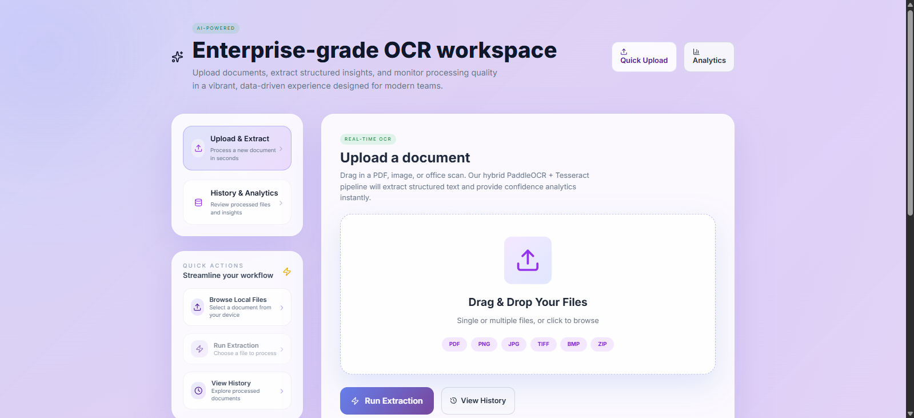
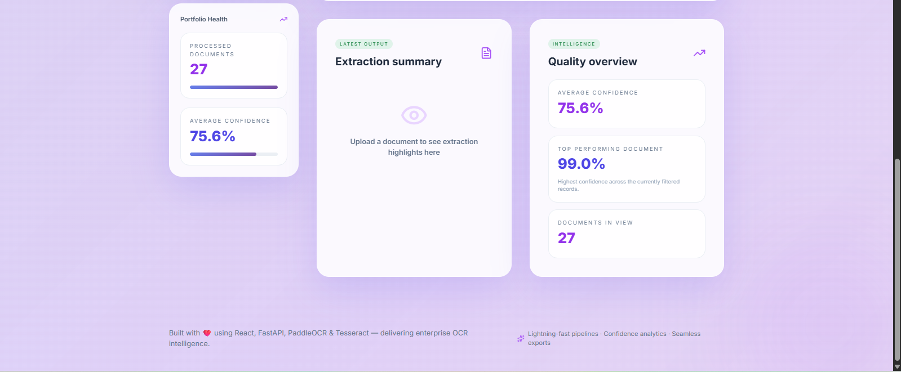
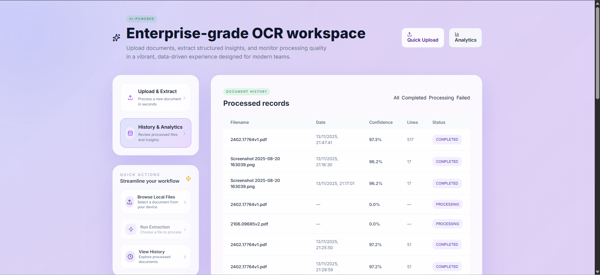

# 🔍 AI-Powered OCR Platform

> Enterprise-grade document text extraction using PaddleOCR & Tesseract with a modern React frontend

[](https://www.python.org/)
[](https://fastapi.tiangolo.com/)
[](https://reactjs.org/)
[](https://www.docker.com/)
[](LICENSE)

<div align="center">
  
  <p><em>Drag & Drop Upload Interface</em></p>
</div>

---

## 📖 Table of Contents

- [Overview](#-overview)
- [Screenshots](#-screenshots)
- [Features](#-features)
- [Tech Stack](#-tech-stack)
- [Architecture](#-architecture)
- [Getting Started](#-getting-started)
- [Usage](#-usage)
- [API Documentation](#-api-documentation)
- [Deployment](#-deployment)
- [Performance](#-performance)
- [Contributing](#-contributing)
- [License](#-license)

---

## 🌟 Overview

This OCR Platform is a full-stack web application that extracts text from documents (PDFs, images) with high accuracy using dual OCR engines. It features batch processing, multiple export formats, and real-time confidence analytics.

### Why This Project?

- **Problem**: Manual data entry from scanned documents is time-consuming and error-prone
- **Solution**: Automated text extraction with 95%+ accuracy using AI-powered OCR
- **Use Cases**: Invoice processing, receipt digitization, document archival, form automation

---

## 📸 Screenshots

### Upload Interface
<div align="center">
  
  <p><em>Modern drag-and-drop interface with support for PDF, PNG, JPG, TIFF, BMP, and ZIP files</em></p>
</div>

### Analytics Dashboard
<div align="center">
  
  <p><em>Real-time confidence metrics and quality overview with processed document statistics</em></p>
</div>

### Document History
<div align="center">
  
  <p><em>Comprehensive document history with filtering, status tracking, and detailed metadata</em></p>
</div>

---

## ✨ Features

### Core Capabilities

- 🚀 **Dual OCR Engines** - PaddleOCR (primary) with automatic Tesseract fallback for optimal accuracy
- 📊 **Batch Processing** - Process up to 10 files simultaneously with parallel execution
- 📄 **Multi-Format Support** - PDF, PNG, JPG, JPEG, TIFF, BMP, and ZIP archives
- ⚡ **Parallel Processing** - Multi-core PDF page processing for faster results
- 📈 **Confidence Analytics** - Real-time accuracy metrics and line-by-line confidence scores
- 💾 **Multiple Export Formats** - TXT, JSON, DOCX, and PDF
- 🎨 **Modern UI** - Beautiful React interface with Tailwind CSS and drag-and-drop functionality
- 📱 **Responsive Design** - Works seamlessly on desktop, tablet, and mobile devices

### Advanced Features

- **Automatic Language Detection** - Supports multiple languages with PaddleOCR
- **Bounding Box Detection** - Returns text coordinates for layout preservation
- **Document History** - Track all processed documents with searchable history
- **Quality Metrics** - Average confidence, top-performing documents, and analytics dashboard
- **ZIP File Support** - Extract and process multiple documents from archives
- **Bulk Operations** - Delete multiple documents at once

<div align="center">
  
  <p><em>Real-time Analytics & Quality Metrics</em></p>
</div>

---

## 🛠 Tech Stack

### Backend

| Technology | Purpose | Version |
|------------|---------|---------|
| **FastAPI** | REST API Framework | 0.104+ |
| **PaddleOCR** | Primary OCR Engine | Latest |
| **Tesseract** | Fallback OCR Engine | 5.0+ |
| **PostgreSQL** | Database | 15+ |
| **SQLAlchemy** | ORM | 2.0+ |
| **Redis** | Task Queue | 7+ |
| **Celery** | Background Jobs | 5.3+ |
| **Alembic** | Database Migrations | 1.12+ |
| **Python** | Core Language | 3.11+ |

### Frontend

| Technology | Purpose | Version |
|------------|---------|---------|
| **React** | UI Framework | 18+ |
| **Vite** | Build Tool | 5+ |
| **Tailwind CSS** | Styling | 3+ |
| **Axios** | HTTP Client | 1.6+ |
| **react-dropzone** | File Upload | 14+ |
| **Lucide React** | Icons | Latest |

### Infrastructure

- **Docker** - Containerization
- **Docker Compose** - Multi-container orchestration
- **Nginx** - (Optional) Reverse proxy

---

## 🏗 Architecture

```
┌─────────────────────────────────────────────────────────┐
│                    Frontend (React)                      │
│  • Drag & Drop Upload    • Real-time Results            │
│  • Batch Processing UI   • Export Options               │
└────────────────────┬────────────────────────────────────┘
                     │ HTTP/REST
                     ▼
┌─────────────────────────────────────────────────────────┐
│              Backend API (FastAPI)                       │
│  ┌──────────────┬──────────────┬───────────────┐       │
│  │   OCR API    │  Batch API   │  Export API   │       │
│  └──────┬───────┴──────┬───────┴───────┬───────┘       │
│         │              │               │                │
│         ▼              ▼               ▼                │
│  ┌──────────────────────────────────────────────┐      │
│  │          OCR Service Layer                    │      │
│  │  • PaddleOCR Engine  • Tesseract Fallback    │      │
│  │  • Parallel PDF Processing                    │      │
│  └──────────────────────────────────────────────┘      │
└────────────┬────────────────────────┬───────────────────┘
             │                        │
             ▼                        ▼
    ┌────────────────┐      ┌────────────────┐
    │   PostgreSQL   │      │     Redis      │
    │   (Database)   │      │  (Task Queue)  │
    └────────────────┘      └────────────────┘
             │                        │
             └────────┬───────────────┘
                      ▼
             ┌────────────────┐
             │ Celery Workers │
             │ (Async Tasks)  │
             └────────────────┘
```

### Data Flow

1. **Upload** → User uploads file(s) via React frontend
2. **Processing** → FastAPI receives files, stores in PostgreSQL
3. **OCR Extraction** → PaddleOCR processes documents (Tesseract as fallback)
4. **Parallel Processing** → Multi-page PDFs processed across multiple CPU cores
5. **Storage** → Extracted text and metadata saved to database
6. **Export** → Results available in multiple formats (TXT, JSON, DOCX, PDF)

---

## 🚀 Getting Started

### Prerequisites

Ensure you have the following installed:

- **Docker** (v24.0+) and **Docker Compose** (v2.20+)
- **Git**
- (Optional) **Node.js** (v18+) for local frontend development
- (Optional) **Python** (3.11+) for local backend development

### Quick Start (Docker)

1. **Clone the repository**
   ```bash
   git clone https://github.com/yourusername/ocr-platform.git
   cd ocr-platform
   ```

2. **Configure environment variables**
   ```bash
   # Copy example env file for backend
   cp backend/.env.example backend/.env
   
   # Edit backend/.env if needed (default values work for Docker)
   ```

3. **Start all services**
   ```bash
   docker-compose up -d
   ```

4. **Run database migrations**
   ```bash
   docker-compose exec backend alembic upgrade head
   ```

5. **Access the application**
   - Frontend: http://localhost:5173
   - Backend API: http://localhost:8000
   - API Documentation: http://localhost:8000/docs

### Local Development Setup

#### Backend

```bash
cd backend

# Create virtual environment
python -m venv .venv
source .venv/bin/activate  # On Windows: .venv\Scripts\activate

# Install dependencies
pip install -r requirements.txt

# Set up environment variables
cp .env.example .env

# Run migrations
alembic upgrade head

# Start development server
uvicorn app.main:app --reload --port 8000
```

#### Frontend

```bash
cd frontend

# Install dependencies
npm install

# Start development server
npm run dev
```

---

## 💡 Usage

### Single File Upload

1. Navigate to http://localhost:5173
2. Drag and drop a file or click "Browse Files"
3. Click "Run Extraction"
4. View results with confidence scores
5. Export in your preferred format (TXT, JSON, DOCX, PDF)

### Batch Processing

1. Upload multiple files (up to 10) at once
2. Click "Extract N Files"
3. View individual results for each file
4. See success/failure status and confidence metrics

### ZIP File Processing

1. Upload a ZIP archive containing documents
2. System automatically extracts and processes each file
3. View consolidated results

### Document History

1. Click "History & Analytics" in the sidebar
2. Filter by status (All, Completed, Processing, Failed)
3. View processing metrics and trends
4. Review all previously processed documents

<div align="center">
  
  <p><em>Document History with Status Tracking & Filtering</em></p>
</div>

---

## 📚 API Documentation

### Endpoints

#### OCR Operations

```http
POST /api/ocr/extract
Content-Type: multipart/form-data

Upload and extract text from a single document.
```

#### Batch Operations

```http
POST /api/batch/upload-multiple
Content-Type: multipart/form-data

Process up to 10 files simultaneously.
```

```http
POST /api/batch/upload-zip
Content-Type: multipart/form-data

Upload ZIP archive and process contained files.
```

```http
DELETE /api/batch/documents/bulk
Content-Type: application/json

Delete multiple documents (up to 50).
```

#### Export Operations

```http
GET /api/export/document/{document_id}/{format}

Export document in specified format (txt, json, docx, pdf).
```

### Interactive API Docs

Once the backend is running, visit:
- **Swagger UI**: http://localhost:8000/docs
- **ReDoc**: http://localhost:8000/redoc

---

## 🚢 Deployment

### Deploy to Production (Render + Vercel)

Detailed deployment guides coming soon!

**Frontend (Vercel):**
- One-click deploy from GitHub
- Automatic HTTPS
- Global CDN

**Backend (Render):**
- Docker-based deployment
- Auto-scaling
- Managed PostgreSQL

See [DEPLOYMENT.md](docs/DEPLOYMENT.md) for detailed instructions.

---

## 📊 Performance

### Benchmarks

| Metric | Value |
|--------|-------|
| **Average Processing Time** | ~2-3s per page |
| **Confidence Score** | 95%+ on clear documents |
| **Max File Size** | 20 MB |
| **Batch Processing** | Up to 10 files |
| **Supported Languages** | 80+ (via PaddleOCR) |
| **PDF Pages** | Unlimited (parallel processing) |

### Optimization Features

- ⚡ Multi-core parallel PDF processing
- 🔄 Automatic engine fallback for better accuracy
- 💾 Efficient database indexing
- 🚀 Redis caching for faster responses
- 📦 Celery async processing for heavy workloads

---

## 🤝 Contributing

Contributions are welcome! Please follow these steps:

1. Fork the repository
2. Create a feature branch (`git checkout -b feature/AmazingFeature`)
3. Commit your changes (`git commit -m 'Add some AmazingFeature'`)
4. Push to the branch (`git push origin feature/AmazingFeature`)
5. Open a Pull Request

Please read [CONTRIBUTING.md](CONTRIBUTING.md) for details on our code of conduct and development process.

---

## 📄 License

This project is licensed under the MIT License - see the [LICENSE](LICENSE) file for details.

---

## 🙏 Acknowledgments

- **PaddleOCR** - High-performance OCR engine
- **Tesseract** - Reliable fallback OCR
- **FastAPI** - Modern Python web framework
- **React** - Powerful UI library

---

## 📧 Contact

**Your Name** - [@yourtwitter](https://twitter.com/yourtwitter) - your.email@example.com

**Project Link**: [https://github.com/yourusername/ocr-platform](https://github.com/yourusername/ocr-platform)

**Live Demo**: [https://your-demo-url.vercel.app](https://your-demo-url.vercel.app)

---

## 🗺 Roadmap

- [ ] Add support for handwritten text recognition
- [ ] Implement table extraction
- [ ] Add multi-language UI
- [ ] Mobile app (React Native)
- [ ] API rate limiting and authentication
- [ ] Webhook support for async processing notifications
- [ ] Custom model training interface

---

**Built with ❤️ using React, FastAPI, PaddleOCR & Tesseract**
